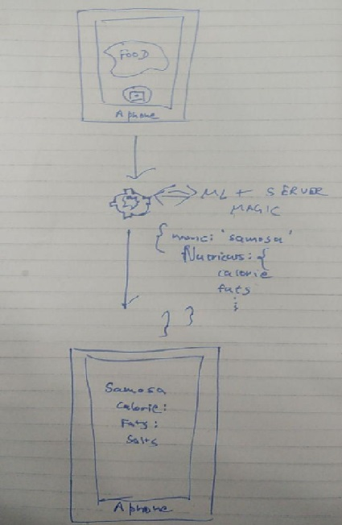
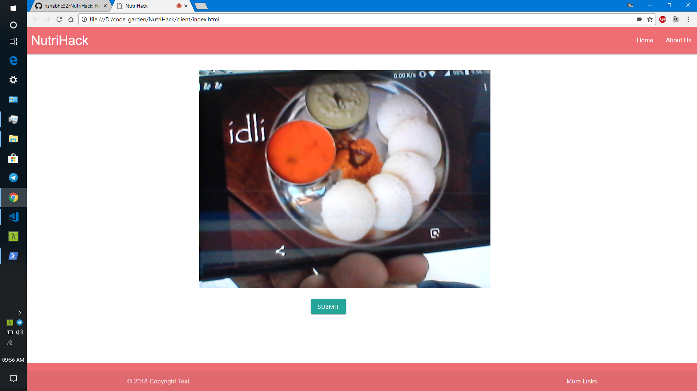
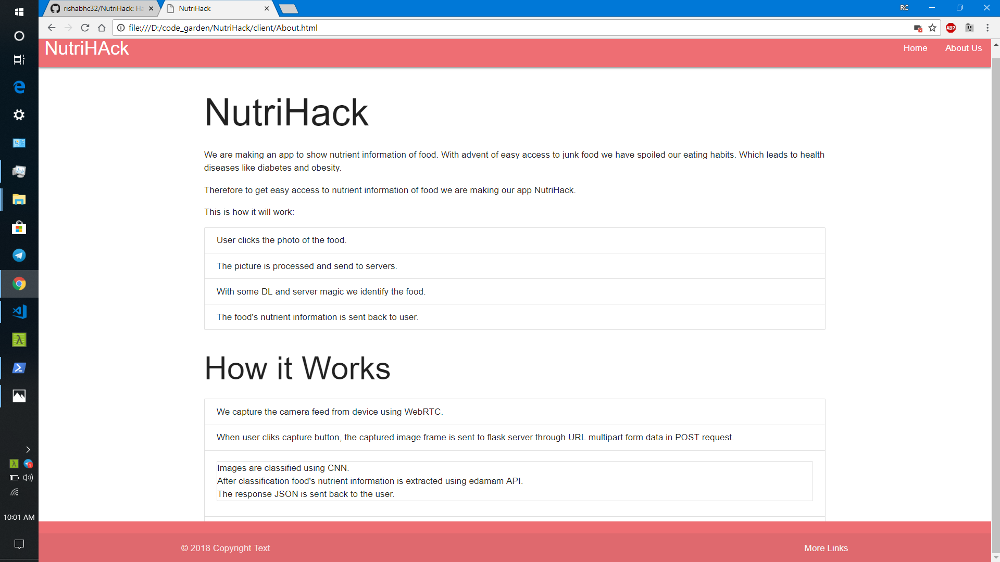
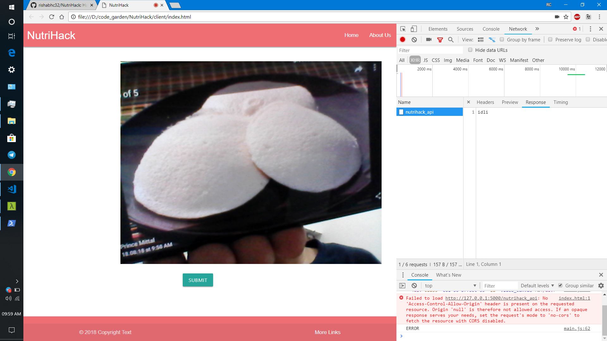
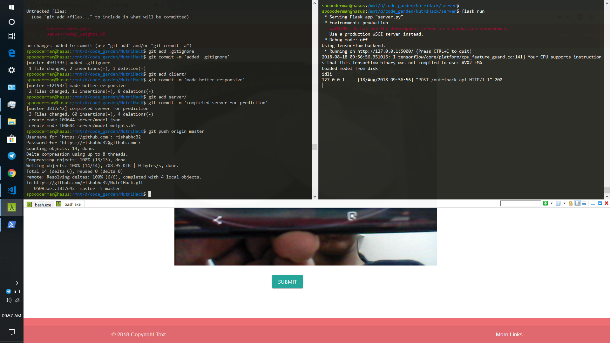
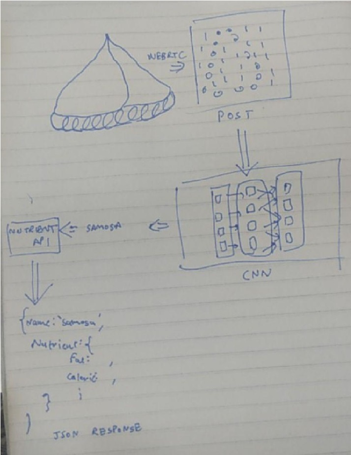

# NutriHack
The dark side of junk foods is not an unknown fact. Several research studies have shown that fast foods and processed foods have increased childhood obesity, heart disease and diabetes and other chronic diseases.  
Not only do they add inches to your waistline, but scientists and researchers have also indicated through various studies that junk food can actually cause serious damage to your brain.

So we have developed a solution to seek nutrient information of food on the go. Pointing phone's camera at the food helps users to identify the food and its associated nutrient values like calorie count, fats, energy, etc.

* This can be further used to keep track of nutrients in a refrigerator. 
* Further it can be used get personalized food suggestion based on user's health and eating habits.

__This is how it will work:__
* User clicks the photo of the food.
* The picture is processed and send to servers.
* With some DL and server magic we identify the food.
* The food's nutrient information is sent back to user.

## Directory Structure
* `client` -- Client side logic
  * `index.html` -- Client/User side `html`
  * `main.js`, `main.css` -- Client/User side `JavaScript` and `CSS`
* `server` -- `Flask` server classifying images and retunring their nutrition value
  * `server.py` -- Implementing `flask` server logic
* `keras_classifier.py` -- CNN implemented in `Keras` for classification
* `dataset_to_csv` -- Converting test/train dataset images to CSV
* `images` -- Readme images

## Working
* We capture the camera feed from device using `WebRTC`.
* When user cliks capture button, the captured image frame is sent to `flask` server through `URL multipart form data` in `POST` request.
* DL and Server magic:
  * Images are classified using CNN.
  * After classification food's nutrient information is extracted using `edamam API`.
  * The response `JSON` is sent back to the user.
* After receiving the response, nutrient info is displayed on user screen.

## Screenshots

## Architecture Diagram

